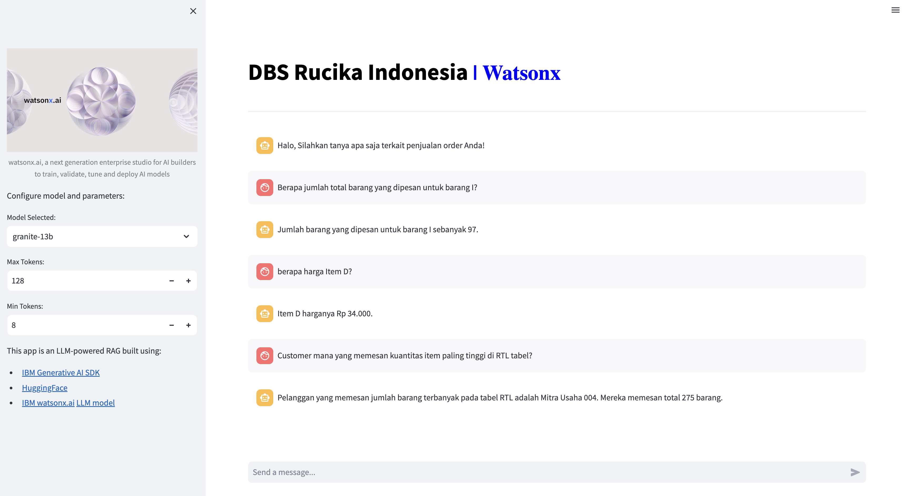

# sql-generator
Generate SQL to human language

# Example Question-Answer
- Berapa jumlah total barang yang dipesan untuk barang I?
- Berapa total harga semua item di tabel RTL?
- Berapa total harga item A di tabel RTL?
- Customer mana yang memesan kuantitas item paling tinggi di RTL tabel?
- berapa harga Item D?

