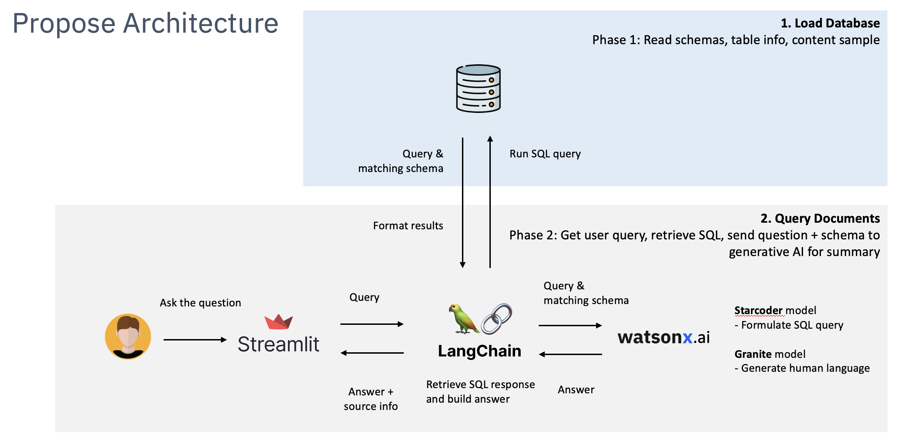
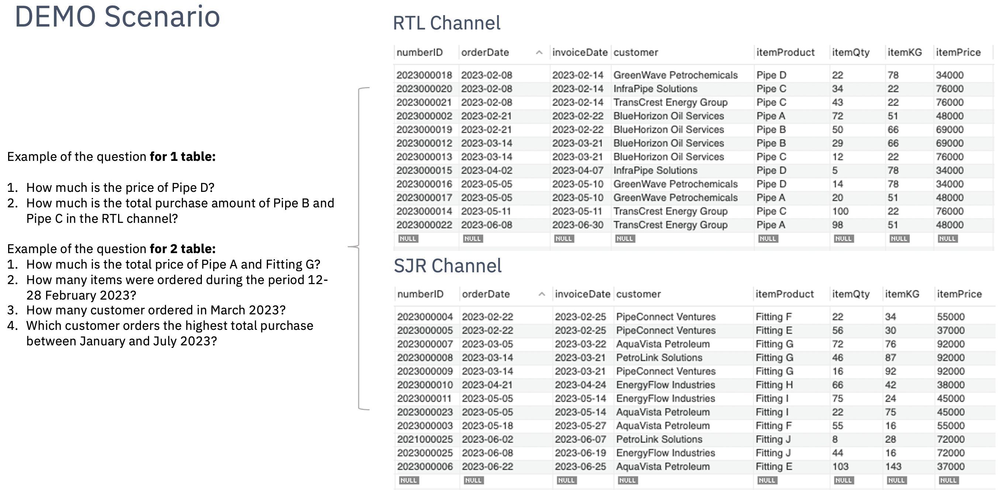
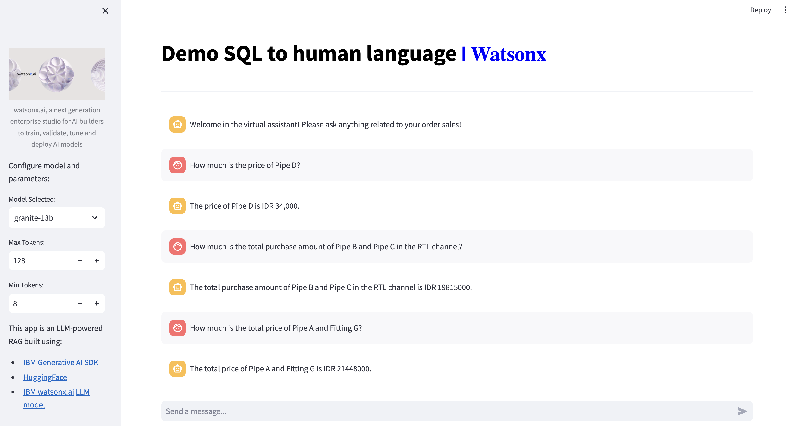
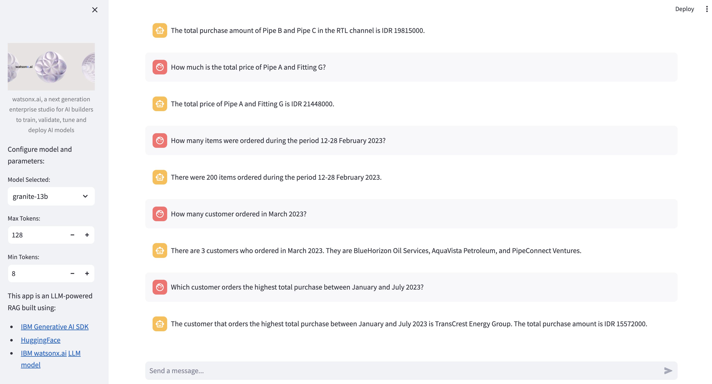

# Demo purposes:
Deal with multiple tables with watsonx.ai by converting SQL to human language

# Example Question-Answer
Example of the question for 1 table:
How much is the price of Pipe D?
How much is the total purchase amount of Pipe B and Pipe C in the RTL channel?

Example of the question for 2 tables:
How much is the total price of Pipe A and Fitting G?
How many items were ordered during the period 12-28 February 2023?
How many customers ordered in March 2023?
Which customer orders the highest total purchase between January and July 2023?

